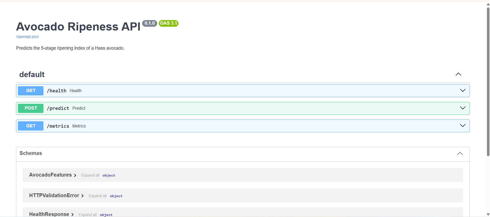
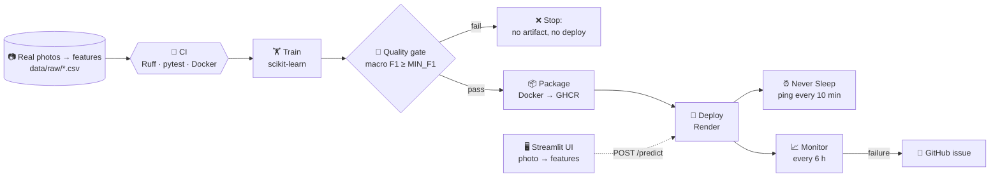

<div align="center">

# 🥑 Avocado Ripeness MLOps

**From a commit to a monitored model in production, with zero manual steps.**

A small avocado ripeness classifier trained on real photos, and a fully automated
GitHub Actions pipeline around it.
Built for the GitHub Dev Day talk *"Accelerating MLOps: Automating the AI pipeline with
GitHub Actions and Copilot"*.

[](https://github.com/ALEMDJOU/ProjetGitHubDevDay/actions/workflows/ci.yml)
[](https://github.com/ALEMDJOU/ProjetGitHubDevDay/actions/workflows/train.yml)
[](https://github.com/ALEMDJOU/ProjetGitHubDevDay/actions/workflows/deploy.yml)

[](LICENSE)
[](https://avocado-ripeness.onrender.com/docs)

`lint + tests` → `train` → `evaluate (quality gate)` → `package` → `deploy` → `monitor`

</div>

---

## 📸 Demo

### RipeVision, the Streamlit interface

<!-- DEMO VIDEO: drag and drop the .mp4 on the empty line below (GitHub web editor). -->

> [!NOTE]
> **TODO(owner): add the RipeVision demo video here.**
> 1. Run the UI (`make ui`, or on Windows `streamlit run app/streamlit_app.py`) and record
>    30 to 60 seconds with the Xbox Game Bar (<kbd>Win</kbd>+<kbd>Alt</kbd>+<kbd>R</kbd>) or OBS:
>    pick a photo, click **Prédire**, show the result, then the *Résultats* and *Modèle* tabs.
> 2. Keep the `.mp4` under **10 MB** (GitHub's limit for videos on free plans).
> 3. On GitHub, open `README.md`, click the pencil icon, and **drag the `.mp4` onto the empty
>    line under the `DEMO VIDEO` comment**. GitHub uploads it and inserts a
>    `https://github.com/user-attachments/assets/...` link, which renders as a video player.
> 4. Commit, then delete this note.
>
> A video file committed in `assets/` does **not** play inside a README: use the upload above.

### The API (FastAPI docs)



## 💡 Why this project

- ML projects often ship through **manual steps**: someone retrains in a notebook, eyeballs a
  metric, builds an image, and uploads it by hand. It is slow and hard to reproduce.
- Here, **every change** (code, data or hyperparameters) goes through **one automated path**
  in GitHub Actions, with a **quality gate** that blocks a worse model from shipping.
- The model is deliberately small (a random forest, trained in seconds on CPU) so that the
  **pipeline** is the star, and anyone can reproduce it for free.

## 🏗️ Architecture



| Stage | Workflow | Tools |
|---|---|---|
| Lint + tests | [`ci.yml`](.github/workflows/ci.yml) | Ruff, pytest, pytest-cov |
| Container check | [`ci.yml`](.github/workflows/ci.yml) | Docker, `curl /health` |
| Train | [`train.yml`](.github/workflows/train.yml) | pandas, scikit-learn, joblib |
| Evaluate + gate | [`train.yml`](.github/workflows/train.yml) | scikit-learn metrics, `MIN_F1` |
| Package | [`deploy.yml`](.github/workflows/deploy.yml) | Docker, GitHub Container Registry |
| Deploy | [`deploy.yml`](.github/workflows/deploy.yml) | Render free web service (deploy hook), FastAPI, Uvicorn |
| Keep warm | [`Never_Sleep.yml`](.github/workflows/Never_Sleep.yml) | curl every 10 min |
| Monitor | [`monitor.yml`](.github/workflows/monitor.yml) | curl, GitHub CLI (issues) |

More details in [`docs/architecture.md`](docs/architecture.md).

## ⚡ Quick start

Requires **Python 3.11** and Git. `pip install -r requirements-dev.txt` also installs the
project's own package, `avoripe` (from `src/`), so every command below works as is.

**Windows (PowerShell)**, no `make` needed:

```powershell
git clone https://github.com/ALEMDJOU/ProjetGitHubDevDay.git; cd ProjetGitHubDevDay
py -3.11 -m venv .venv; .\.venv\Scripts\Activate.ps1
pip install -r requirements-dev.txt
python -m avoripe.train; python -m avoripe.evaluate
uvicorn avoripe.api:app --port 7860                      # http://localhost:7860/docs
```

**macOS / Linux**, with `make`:

```bash
git clone https://github.com/ALEMDJOU/ProjetGitHubDevDay.git && cd ProjetGitHubDevDay
python3.11 -m venv .venv && source .venv/bin/activate
make install
make train evaluate
make run                                                 # http://localhost:7860/docs
```

> [!TIP]
> If PowerShell refuses to run `Activate.ps1`, run once
> `Set-ExecutionPolicy -Scope CurrentUser RemoteSigned`, or skip activation and prefix the
> commands with `.\.venv\Scripts\` (e.g. `.\.venv\Scripts\python -m avoripe.train`).

Predict the ripeness of a real avocado photo (`T20_d05_001_a_3`, labelled stage 3 by the
dataset authors), from a second terminal at the project root (`curl.exe` on Windows):

```bash
curl -s -X POST http://localhost:7860/predict -H "Content-Type: application/json" -d "@tests/fixtures/known_sample.json"
```

```json
{"ripeness":"ripe_first_stage","probabilities":{"breaking":0.045,"overripe":0.0661,"ripe_first_stage":0.6822,"ripe_second_stage":0.2067,"underripe":0.0}}
```

Or simply open <http://localhost:7860/docs> and use **Try it out** on `POST /predict`.

<details>
<summary><b>What is the <code>Makefile</code>? Targets and their Windows equivalents</b></summary>

A `Makefile` is a list of named shortcuts for the `make` tool (standard on macOS and Linux, not
installed on Windows): `make test` runs the full test command for you. Every target is just a
shortcut; on Windows, type the command on the right instead.

| Target | What it does | Same thing without `make` |
|---|---|---|
| `make install` | Install dependencies + the `avoripe` package | `pip install -r requirements-dev.txt` |
| `make lint` | Ruff lint + format check | `ruff check .` then `ruff format --check .` |
| `make format` | Auto-fix and format the code | `ruff check --fix .` then `ruff format .` |
| `make test` | Tests with the 80% coverage gate | `pytest --cov=src --cov-fail-under=80` |
| `make train` | Train → `models/model.joblib` | `python -m avoripe.train` |
| `make evaluate` | Metrics + quality gate → `metrics/` | `python -m avoripe.evaluate` |
| `make run` | API on port 7860 | `uvicorn avoripe.api:app --port 7860` |
| `make ui` | Streamlit UI on port 8501 | `pip install -r requirements-ui.txt` then `streamlit run app/streamlit_app.py` |
| `make docker` | Build and run the Docker image | `docker build -t avoripe:local .` then `docker run --rm -p 7860:7860 avoripe:local` |
| `make all` | lint + test + train + evaluate | the four commands above, in that order |

</details>

| Endpoint | What it does |
|---|---|
| `GET /` | Redirects to `/docs` |
| `GET /health` | Liveness, whether the model is loaded, deployed commit SHA (`version`) |
| `POST /predict` | Validated features → ripeness class + per-class probabilities |
| `GET /metrics` | Request count, mean latency, distribution of predicted classes |
| `GET /docs` | Interactive Swagger UI |

### 🖥️ Streamlit UI: RipeVision

Upload a photo (or pick a real one from the dataset), click **Prédire**, and the UI extracts
its colour features with the same code as the dataset and sends them to the **live API**.
The model answers with the 5 real stages; the UI groups them into 3 classes for readability
(**Unripe** = stages 1-2, **Ripe** = 3-4, **Overripe** = 5) and shows the confidence, a
recommendation, the exact stage and, for dataset photos, the true label. Tabs: *Analyse*,
*Résultats* (session history) and *Modèle* (real metrics from `metrics/metrics.json`).
Theme in [`.streamlit/config.toml`](.streamlit/config.toml); no result is ever simulated.

```bash
make ui                                                 # http://localhost:8501
# Windows: pip install -r requirements-ui.txt; streamlit run app/streamlit_app.py
```

It calls `https://avocado-ripeness.onrender.com` by default (the URL is not shown in the UI); set `AVORIPE_API_URL` to use a
local API (`make run`). The dataset photos must be in `data/images/` (see
[`data/README.md`](data/README.md)); uploads work without them.

## 🔁 The pipeline

| Workflow | Trigger | What it does | Output |
|---|---|---|---|
| **CI** | Pull request, push to `main` | Ruff lint + format check, pytest (coverage ≥ 80%), Docker build, run container, `curl /health` | ✅/❌ on the PR |
| **Train & Evaluate** | Push to `main` touching `data/**` or training code, weekly cron, manual (`min_f1` input) | Train, evaluate, quality gate, job summary with metrics + confusion matrix | Artifact `model` (`model.joblib` + `metrics.json`, 30 days) |
| **Deploy** | After a **successful** Train & Evaluate on `main`, or manual (`run_id` optional: empty = latest green training run) | Download the artifact, push image to GHCR (`sha` + `latest`), redeploy it on Render, wait until live `/health` reports the new commit SHA | Image on GHCR, live API on Render |
| **Never Sleep** | Every 10 min, manual | Ping `/health` so the free Render instance never spins down | Always-warm API |
| **Monitor** | Every 6 h, manual | Check live `/health` and one known real prediction | GitHub issue on failure |

### 🚦 The quality gate

`python -m avoripe.evaluate` computes accuracy, macro precision, macro recall and **macro F1**
on a held-out set of avocados, then compares macro F1 to `MIN_F1`:

- macro F1 ≥ `MIN_F1` → exit code 0, the `model` artifact is uploaded, **Deploy** runs.
- macro F1 < `MIN_F1` → **exit code 1**, the job goes red, no artifact, **nothing is deployed**.

`MIN_F1` comes from, in order: the `min_f1` input of a manual run → the repository variable
`MIN_F1` → the default `0.75` in [`config.py`](src/avoripe/config.py). Raising it is how you
tighten the bar; try `min_f1 = 0.95` to watch the gate block a release.

## 📊 Results

From a real local run (`make train evaluate`, held-out fold of 2,952 photos from avocados never
seen in training):

| Metric | Value |
|---|---|
| Accuracy | 0.8083 |
| Macro precision | 0.8039 |
| Macro recall | 0.8008 |
| **Macro F1** | **0.8022** |

<details>
<summary><b>Confusion matrix</b> (rows = true, columns = predicted)</summary>

| true \ pred | underripe | breaking | ripe_first_stage | ripe_second_stage | overripe |
|---|---|---|---|---|---|
| **underripe** | 664 | 51 | 1 | 0 | 0 |
| **breaking** | 56 | 335 | 55 | 2 | 0 |
| **ripe_first_stage** | 0 | 46 | 409 | 95 | 0 |
| **ripe_second_stage** | 0 | 0 | 85 | 502 | 77 |
| **overripe** | 0 | 0 | 10 | 88 | 476 |

Almost all errors are between **neighbouring** stages.

</details>

**Classes** (5-stage Ripening Index of the dataset): `underripe` · `breaking` ·
`ripe_first_stage` · `ripe_second_stage` · `overripe`.

The latest numbers from CI are in the job summary of the most recent
[Train & Evaluate run](https://github.com/ALEMDJOU/ProjetGitHubDevDay/actions/workflows/train.yml).

## 🤖 How GitHub Copilot is used

The repo is set up so Copilot has the context it needs: typed, short, documented functions and
[`.github/copilot-instructions.md`](.github/copilot-instructions.md) (stack, data rules,
conventions, what never to do).

| Where | How to use it |
|---|---|
| **Workflows** | Ask Copilot to add or change a job; the instructions enforce minimal `permissions`, timeouts and pinned actions |
| **Tests** | Generate pytest cases from the existing `real_df` / `tiny_model_path` fixtures (real rows only) |
| **Docs** | Update the README, `data/README.md` or the demo script from the code |
| **Code review** | Enable Copilot code review on pull requests |
| **Onboarding** | Ask Copilot Chat "how does a data change reach production?" with the repo as context |

Example prompts:

> *"Add a pytest test that checks `/predict` returns 422 when `dark_fraction` is greater than 1,
> using a real row from the `real_df` fixture."*

> *"In `train.yml`, append `metrics/report.md` to the job summary even when the quality gate
> fails."*

## 🗂️ Dataset

| | |
|---|---|
| **Source** | [*'Hass' Avocado Ripening Photographic Dataset*](https://data.mendeley.com/datasets/3xd9n945v8/1), Mendeley Data |
| **Authors** | Pedro Xavier, Pedro Rodrigues, Cristina L. M. Silva (2024) |
| **License** | [CC BY 4.0](https://creativecommons.org/licenses/by/4.0/) |
| **Content** | 14,710 real photos of 478 Hass avocados stored at 10 °C, 20 °C or ambient, photographed daily |
| **In this repo** | [`data/raw/avocado_features.csv`](data/raw/avocado_features.csv): one row per photo, official labels + skin colour statistics (Lab) extracted once by [`scripts/extract_features.py`](scripts/extract_features.py) |

| Class | Photos | Share |
|---|---|---|
| underripe | 3,568 | 24.3% |
| breaking | 2,228 | 15.1% |
| ripe_first_stage | 2,756 | 18.7% |
| ripe_second_stage | 3,294 | 22.4% |
| overripe | 2,864 | 19.5% |

> Xavier, P., Rodrigues, P., & Silva, C. L. M. (2024). *'Hass' Avocado Ripening Photographic
> Dataset* (Version 1) [Data set]. Mendeley Data. https://doi.org/10.17632/3xd9n945v8.1

Schema, checksums, how to rebuild the CSV and where to put the photos locally (`data/images/`,
used by the Streamlit UI): [`data/README.md`](data/README.md).

## 📁 Project structure

<details>
<summary>Show tree</summary>

```text
.
├── .github/
│   ├── workflows/            # ci, train, deploy, monitor, Never_Sleep
│   ├── ISSUE_TEMPLATE/       # bug report, feature request
│   └── copilot-instructions.md
├── data/
│   ├── raw/                  # real feature table (CSV), committed
│   ├── images/               # local copy of the 14,710 photos (git-ignored)
│   └── README.md             # source, license, checksums, schema
├── app/streamlit_app.py      # Streamlit UI: photo -> features -> live API -> stage
├── scripts/                  # one-off feature extraction from the original photos
├── src/avoripe/
│   ├── config.py             # paths, constants, feature names
│   ├── data.py               # load, validate, grouped + stratified split
│   ├── train.py              # sklearn Pipeline -> models/model.joblib
│   ├── evaluate.py           # metrics, report, quality gate (exit 1)
│   ├── features.py           # photo -> colour features (shared by script and UI)
│   ├── schemas.py            # Pydantic request/response models
│   └── api.py                # FastAPI: /health, /predict, /metrics
├── tests/                    # pytest, real rows + 1 real photo in fixtures/, no network
├── deploy/space_README.md    # optional Hugging Face Space front matter
├── docs/                     # architecture, demo script
├── Dockerfile  Makefile  pyproject.toml  requirements*.txt
```

</details>

## ⚙️ Configuration

Set these in **Settings → Secrets and variables → Actions** (never in code):

| Name | Kind | Scope | Used by | Example |
|---|---|---|---|---|
| `RENDER_DEPLOY_HOOK_URL` | Secret | Environment `production` | `deploy.yml` | Deploy hook of the Render service (Settings → Deploy Hook) |
| `APP_URL` | Variable | Environment `production` (read by every job that uses it) | `deploy.yml`, `monitor.yml`, `Never_Sleep.yml` | `https://avocado-ripeness.onrender.com` |
| `HF_SPACE` + `HF_TOKEN` | Variable + Secret | Optional | `deploy.yml` | Also push to a Hugging Face Space (Docker SDK) |
| `MIN_F1` | Variable | Repository | `train.yml` | `0.75` |

Also: create the environment **`production`**, make the GHCR package **public** (so Render can
pull it), and create a Render **Web Service → Existing image** from
`ghcr.io/alemdjou/projetgithubdevday:latest` on the **Free** plan with `/health` as health check.

## 🧭 Limitations and roadmap

- **Toy scale:** ~15k rows, one random forest. The point is the pipeline, not the model.
- **Features, not pixels:** the API takes colour statistics, not an image. The Streamlit UI
  extracts them from a photo with the dataset's own code; photos far from the dataset's setup
  (one avocado, white background, fixed camera) will give unreliable features.
- **Photo-level split:** photos of the same avocado on different days are correlated; the split
  is grouped by avocado to avoid leakage, but only one held-out fold is used.
- **No data versioning** beyond Git + checksums (no DVC by design).
- **No model registry:** models live as 30-day workflow artifacts and inside Docker images.
- **Free hosting limits:** Render's free plan gives 750 instance-hours per month (enough for one
  always-on service) and restarts can take a minute; `Never_Sleep.yml` only prevents idle spin-down.
- **Minimal monitoring:** health + one known prediction; `/metrics` is in-memory and resets on
  restart. No drift detection yet.

## 🤝 Contributing

1. Open an issue with the templates, then a branch and a PR (Conventional Commits:
   `feat:`, `fix:`, `ci:`, `docs:`, `test:`, `chore:`).
2. Run `make lint test` locally; CI must be green.
3. Real data only: no synthetic or fabricated rows, not even in tests.

## 📄 License

Code: [MIT](LICENSE). Data: derived from the *'Hass' Avocado Ripening Photographic Dataset*,
[CC BY 4.0](https://creativecommons.org/licenses/by/4.0/); see [`data/README.md`](data/README.md).
