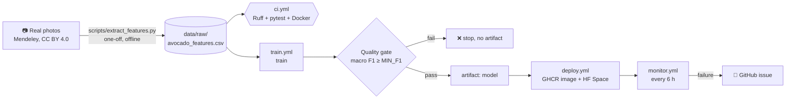

# Architecture

## Flow

## Stages

| Stage | Where | Tool | Output |
|---|---|---|---|
| Feature extraction | `scripts/extract_features.py` (offline, once) | Pillow, numpy | `data/raw/avocado_features.csv` |
| Lint + tests | `ci.yml` | Ruff, pytest, pytest-cov | pass/fail, coverage |
| Package check | `ci.yml` | Docker | container answers `/health` |
| Train | `train.yml` → `avoripe.train` | scikit-learn | `models/model.joblib` |
| Evaluate + gate | `train.yml` → `avoripe.evaluate` | scikit-learn | `metrics/metrics.json`, `metrics/report.md`, exit 1 if gate fails |
| Package + deploy | `deploy.yml` | Docker, GHCR, huggingface_hub | image `sha` + `latest`, Space updated |
| Monitor | `monitor.yml` | curl, gh | issue on failure |

## Why a one-off extraction step?

The raw dataset is ~472 MB of JPEGs. Downloading and decoding it on every CI run would break
the "train + evaluate in under 2 minutes" budget. Instead, colour statistics are computed once
from every real photo and committed as a small CSV. Every row still maps to one real photograph
(`file_name` column), so the data is real, traceable and reproducible.

## Data split

Each avocado is photographed many times (two sides, every day). A random row split would put
photos of the same fruit in train and test and inflate the score. `split_data()` uses
`StratifiedGroupKFold` (5 folds, `RANDOM_STATE = 42`) and keeps the first fold as the test set:
stratified by ripeness stage, grouped by avocado.

## Model

One scikit-learn `Pipeline`: one-hot encoding of `storage_group` + passthrough numeric features
→ `RandomForestClassifier`. Saved with joblib; the API loads it from `MODEL_PATH`.
